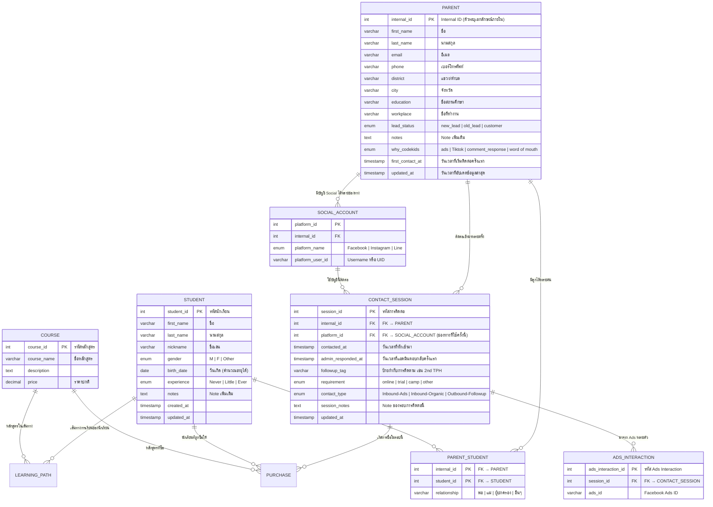

```mermaid

erDiagram

    %% ════════════════════════════════════════════
    %% CORE IDENTITY LAYER
    %% ════════════════════════════════════════════

    PARENT {
        int         internal_id         PK  "Internal ID (ตัวระบุเอกลักษณ์ภายใน)"
        varchar     first_name              "ชื่อ"
        varchar     last_name               "นามสกุล"
        varchar     email                   "อีเมล"
        varchar     phone                   "เบอร์โทรศัพท์"
        varchar     district                "แขวง/ตำบล"
        varchar     city                    "จังหวัด"
        varchar     education               "ชื่อสถานศึกษา"
        varchar     workplace               "ชื่อที่ทำงาน"
        enum        lead_status             "new_lead | old_lead | customer"
        text        notes                   "Note เพิ่มเติม"
        enum        why_codekids            "ads | Tiktok | comment_response | word of mouth"
        timestamp   first_contact_at        "วันเวลาที่เริ่มติดต่อครั้งแรก"
        timestamp   updated_at              "วันเวลาที่อัปเดตข้อมูลล่าสุด"
    }

    SOCIAL_ACCOUNT {
        int         platform_id          PK  
        int         internal_id          FK  
        enum        platform_name            "Facebook | Instagram | Line"
        varchar     platform_user_id         "Username หรือ UID"
    }

    STUDENT {
        int         student_id          PK  "รหัสนักเรียน"
        varchar     first_name              "ชื่อ"
        varchar     last_name               "นามสกุล"
        varchar     nickname                "ชื่อเล่น"
        enum        gender                  "M | F | Other"
        date        birth_date              "วันเกิด (คำนวณอายุได้)"
        enum        experience              "Never | Little | Ever"
        text        notes                   "Note เพิ่มเติม"
        timestamp   created_at
        timestamp   updated_at
    }

    PARENT_STUDENT {
        int         internal_id         PK  "FK → PARENT"
        int         student_id          PK  "FK → STUDENT"
        varchar     relationship            "พ่อ | แม่ | ผู้ปกครอง | อื่นๆ"
    }

    %% ════════════════════════════════════════════
    %% COURSE CATALOGUE LAYER
    %% ════════════════════════════════════════════

    COURSE {
        int         course_id           PK  "รหัสหลักสูตร"
        varchar     course_name             "ชื่อหลักสูตร"
        text        description
        decimal     price                   "ราคาปกติ"
    }

    %% ════════════════════════════════════════════
    %% CONTACT & INTERACTION LAYER
    %% ════════════════════════════════════════════

    CONTACT_SESSION {
        int         session_id          PK  "รหัสการติดต่อ"
        int         internal_id         FK  "FK → PARENT"
        int         platform_id         FK  "FK → SOCIAL_ACCOUNT (ช่องทางที่ใช้ครั้งนี้)"
        timestamp   contacted_at            "วันเวลาที่ทักเข้ามา"
        timestamp   admin_responded_at      "วันเวลาที่แอดมินตอบกลับครั้งแรก"
        varchar     followup_tag            "ป้ายกำกับการติดตาม เช่น 2nd TPH"
        enum        requirement             "online | trial | camp | other"
        enum        contact_type            " Inbound-Ads | Inbound-Organic | Outbound-Followup"
        text        session_notes           "Note ของรอบการติดต่อนี้"
        timestamp   updated_at
    }

    ADS_INTERACTION {
        int         ads_interaction_id  PK  "รหัส Ads Interaction"
        int         session_id          FK  "FK → CONTACT_SESSION"
        varchar     ads_id                  "Facebook Ads ID"
    }


    PARENT            ||--o{ SOCIAL_ACCOUNT    : "มีบัญชี Social ได้หลายช่องทาง"
    PARENT            ||--o{ PARENT_STUDENT    : "มีลูกได้หลายคน"
    STUDENT           ||--o{ PARENT_STUDENT    : "มีผู้ปกครองได้หลายคน"
    PARENT            ||--o{ CONTACT_SESSION   : "ติดต่อเข้ามาหลายครั้ง"
    SOCIAL_ACCOUNT    ||--o{ CONTACT_SESSION   : "ใช้บัญชีนี้ติดต่อ"
    CONTACT_SESSION   ||--o{ ADS_INTERACTION   : "มาจาก Ads หลายตัว"
    CONTACT_SESSION   ||--o{ PURCHASE          : "เกิดการซื้อในรอบนี้"
    STUDENT           ||--o{ PURCHASE          : "นักเรียนที่ถูกซื้อให้"
    COURSE            ||--o{ PURCHASE          : "หลักสูตรที่ซื้อ"
    STUDENT           ||--o{ LEARNING_PATH     : "เส้นทางการเรียนของนักเรียน"
    COURSE            ||--o{ LEARNING_PATH     : "หลักสูตรในเส้นทาง"
    
```