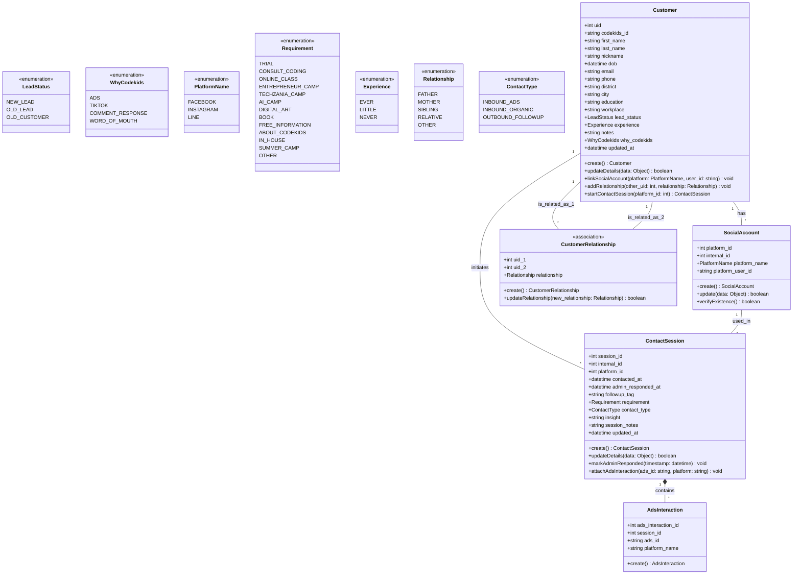

# Class Diagram: CRM & Identity Management System (Updated)
 
## Overview
ระบบนี้จัดการข้อมูล Lead และการติดต่อของ Codekids
โดยเชื่อมโยง Customer ↔ SocialAccount ↔ ContactSession
เพื่อ track ทุก interaction จากหลาย platform (FB/IG/Line)
และป้องกัน Duplicate Profile จากการทักหลายช่องทาง
 
## Diagram
 

 
## Notes
 
### `Customer` (รวม Parent + Student เดิม)
เดิมระบบแยก `Parent` (ผู้ปกครอง) กับ `Student` (นักเรียน) ออกจากกัน และผูกด้วย `ParentStudent`
ตอนนี้รวมทั้งสองเป็น `Customer` เดียวกัน เนื่องจากทั้งพ่อแม่และเด็กต่างก็เป็น "ผู้ติดต่อ/ลูกค้า" ที่อาจมี Social Account, ประวัติการติดต่อ (`ContactSession`) ของตัวเอง และสามารถเป็นทั้งฝั่ง "ผู้แนะนำ" หรือ "ผู้ถูกแนะนำ" ในความสัมพันธ์ได้
 
> field `experience` (เคยเขียนโค้ดมาก่อนหรือไม่) เดิมอยู่ใน `Student` ตอนนี้ย้ายมาอยู่ใน `Customer` เพื่อให้ใช้ได้กับลูกค้าทุกคน ไม่จำกัดว่าต้องเป็นเด็ก
 
---
 
### `CustomerRelationship` (แทนที่ `ParentStudent`)
**Type** association แบบ **self-referencing** บน `Customer` (uid_1 ↔ uid_2)
**วัตถุประสงค์** ระบุความสัมพันธ์ระหว่างลูกค้าสองคน เช่น พ่อ-ลูก, แม่-ลูก, พี่น้อง, ญาติ หรืออื่นๆ
**ตัวอย่าง** Customer A (พ่อ) — `FATHER` → Customer B (ลูก)
 
> ต่างจากเดิมตรงที่ไม่ได้ผูกเฉพาะ Parent กับ Student แบบตายตัวอีกต่อไป แต่เป็นความสัมพันธ์ระหว่าง Customer คนใดก็ได้กับ Customer อีกคน ทำให้รองรับกรณีที่ซับซ้อนขึ้น เช่น พี่น้องที่ทั้งคู่เป็นลูกค้า หรือญาติที่แนะนำกันมา
> เพิ่ม enum `OTHER` เข้ามาใน `Relationship` เพื่อรองรับกรณีที่ไม่เข้าเงื่อนไข FATHER/MOTHER/SIBLING/RELATIVE
 
---
 
### `Customer.addRelationship(other_uid, relationship)`
**Input** `other_uid: int`, `relationship: Relationship`
**วัตถุประสงค์** สร้างความสัมพันธ์ระหว่าง Customer ปัจจุบันกับ Customer อีกคนหนึ่ง (สร้าง record ใน `CustomerRelationship`)
 
> แทนที่ `addStudentRelationship` เดิม เนื่องจากทั้งสองฝั่งของความสัมพันธ์เป็น `Customer` เหมือนกัน ไม่มีการแยก Role ตายตัวว่าใครเป็น Parent ใครเป็น Student
 
---
 
### `ContactSession.followup_tag`
**Type** `string` (free-text)
**เขียนโดย** Sale Admin
**วัตถุประสงค์** ระบุลำดับหรือสถานะการติดตามผล
**ตัวอย่าง** `"1st follow-up"`, `"2nd follow-up"`
 
> ออกแบบมาเพื่อรองรับกระบวนการทำงานเดิมจาก Excel ที่ต้องนับครั้งการทักซ้ำ
 
---
 
### `ContactSession.insight`
**Type** `string` (free-text)
**เขียนโดย** Sale Admin
**วัตถุประสงค์** บันทึกข้อวิเคราะห์เชิงลึกที่ได้จากการพูดคุย
**ตัวอย่าง** บริบทของครอบครัว, พฤติกรรมของเด็ก, โอกาสในการปิดการขาย
 
---
 
### `ContactSession.session_notes`
**Type** `string` (free-text)
**เขียนโดย** Data Entry Admin
**วัตถุประสงค์** Log การพูดคุย หรือข้อความดิบที่ลูกค้าส่งมาในแชต
 
> Fallback field สำหรับข้อมูลที่ระบบยังไม่มีฟิลด์เฉพาะรองรับ เพื่อป้องกันข้อมูลสูญหาย
 
---
 
### `Customer.startContactSession(platform_id)`
**Input** `platform_id: int`
**Output** `ContactSession`
**วัตถุประสงค์** เปิด Ticket สนทนาใหม่ พร้อมระบุว่าลูกค้าติดต่อผ่าน Social Account ตัวไหน
 
> จำเป็นต้องส่ง `platform_id` เพื่อให้ระบบ track ได้ว่า session นี้มาจาก Line, Facebook หรือ Instagram
 
---
 
### `SocialAccount.verifyExistence()`
**Output** `boolean`
**ตรวจสอบกับ** Database ภายใน (ไม่ใช่ platform API)
**วัตถุประสงค์** เช็คว่า `platform_user_id` นี้มีอยู่ในระบบแล้วหรือยัง
 
> หากพบแล้ว ระบบจะดึง `uid` เดิมมาใช้แทนการสร้าง Customer ใหม่ เพื่อป้องกัน Duplicate Profile
 
---
 
### `ContactSession.attachAdsInteraction(ads_id, platform)`
**Input** `ads_id: string`, `platform: string`
**วัตถุประสงค์** สร้าง Record ใน `AdsInteraction` ผูกกับ Session นี้
**ที่มาของ ads_id** Admin กรอกเอง หรือจากระบบ OCR สแกนภาพ
 
> ใช้สำหรับทำ Attribution และคำนวณ ROI ทางการตลาด