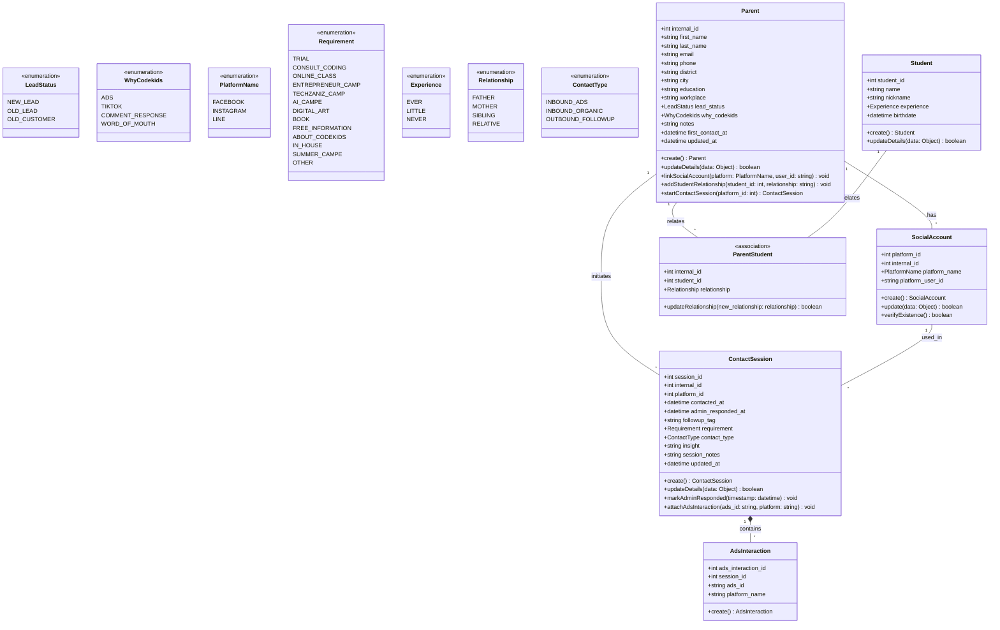

# Class Diagram: CRM & Identity Management System

## Overview
ระบบนี้จัดการข้อมูล Lead และการติดต่อของ Codekids
โดยเชื่อมโยง Parent ↔ SocialAccount ↔ ContactSession
เพื่อ track ทุก interaction จากหลาย platform (FB/IG/Line)
และป้องกัน Duplicate Profile จากการทักหลายช่องทาง

## Diagram

## Notes

### `ContactSession.followup_tag`

**Type** `string` (free-text) 
**เขียนโดย**  Sale Admin 
**วัตถุประสงค์** ระบุลำดับหรือสถานะการติดตามผล
**ตัวอย่าง** `"1st follow-up"`, `"2nd follow-up"`
 
> ออกแบบมาเพื่อรองรับกระบวนการทำงานเดิมจาก Excel ที่ต้องนับครั้งการทักซ้ำ

---

### `ContactSession.insight`
**Type** `string` (free-text) 
**เขียนโดย**  Sale Admin 
**วัตถุประสงค์** บันทึกข้อวิเคราะห์เชิงลึกที่ได้จากการพูดคุย
**ตัวอย่าง** บริบทของครอบครัว, พฤติกรรมของเด็ก, โอกาสในการปิดการขาย

---

### `ContactSession.session_notes`
**Type** `string` (free-text) 
**เขียนโดย**  Data Entry Admin 
**วัตถุประสงค์**  Log การพูดคุย หรือข้อความดิบที่ลูกค้าส่งมาในแชต
 
> Fallback field สำหรับข้อมูลที่ระบบยังไม่มีฟิลด์เฉพาะรองรับ เพื่อป้องกันข้อมูลสูญหาย

---

### `Parent.startContactSession(platform_id)`
**Input** `platform_id: int`
**Output** `ContactSession`
**วัตถุประสงค์** เปิด Ticket สนทนาใหม่ พร้อมระบุว่าลูกค้าติดต่อผ่าน Social Account ตัวไหน
 
> จำเป็นต้องส่ง `platform_id` เพื่อให้ระบบ track ได้ว่า session นี้มาจาก Line, Facebook หรือ Instagram

---

### `SocialAccount.verifyExistence()`
**Output** `boolean`
**ตรวจสอบกับ** Database ภายใน (ไม่ใช่ platform API)
**วัตถุประสงค์** เช็คว่า `platform_user_id` นี้มีอยู่ในระบบแล้วหรือยัง

> หากพบแล้ว ระบบจะดึง `internal_id` เดิมมาใช้แทนการสร้าง Parent ใหม่ เพื่อป้องกัน Duplicate Profile

---

### `ContactSession.attachAdsInteraction(ads_id, platform)`
**Input** `ads_id: string`, `platform: string`
**วัตถุประสงค์** สร้าง Record ใน `AdsInteraction` ผูกกับ Session นี้
**ที่มาของ ads_id** Admin กรอกเอง หรือจากระบบ OCR สแกนภาพ
 
> ใช้สำหรับทำ Attribution และคำนวณ ROI ทางการตลาด