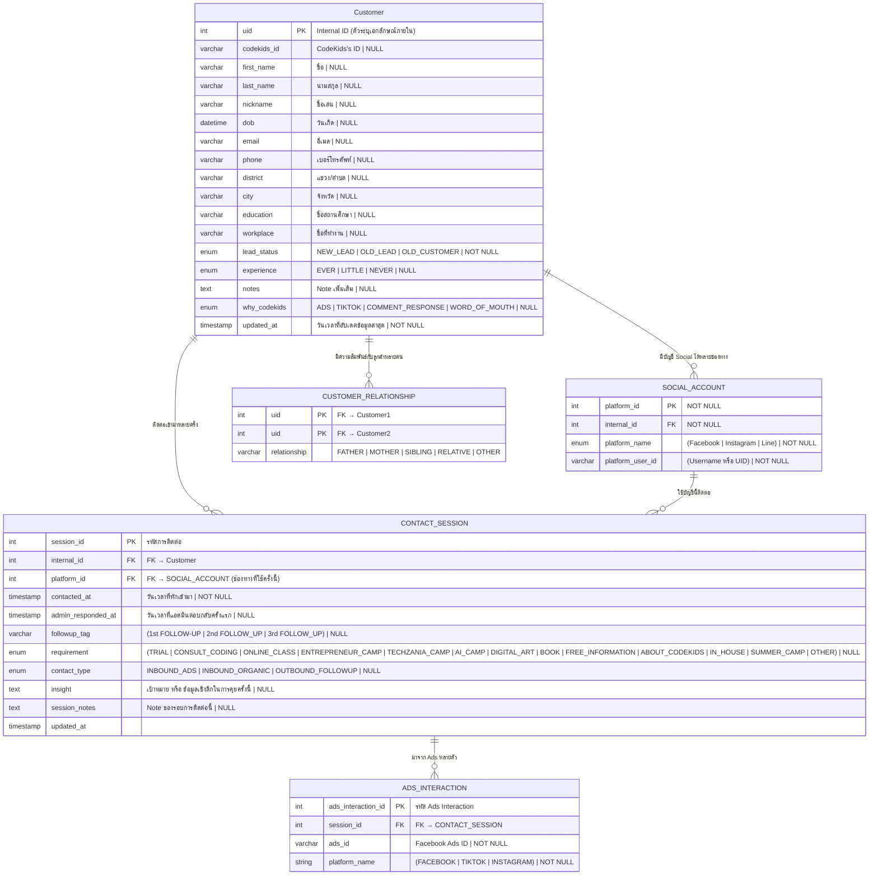

```mermaid

erDiagram

    %% ════════════════════════════════════════════
    %% CORE IDENTITY LAYER
    %% ════════════════════════════════════════════

    Customer {
        int         uid         PK  "Internal ID (ตัวระบุเอกลักษณ์ภายใน)"
        varchar     codekids_id             "CodeKids's ID | NULL"
        varchar     first_name              "ชื่อ | NULL"
        varchar     last_name               "นามสกุล | NULL"
        varchar     nickname                "ชื่อเล่น | NULL"
        datetime    dob                     "วันเกิด | NULL"
        varchar     email                   "อีเมล | NULL"
        varchar     phone                   "เบอร์โทรศัพท์ | NULL"
        varchar     district                "แขวง/ตำบล | NULL"
        varchar     city                    "จังหวัด | NULL"
        varchar     education               "ชื่อสถานศึกษา | NULL"
        varchar     workplace               "ชื่อที่ทำงาน | NULL"
        enum        lead_status             "NEW_LEAD | OLD_LEAD | OLD_CUSTOMER  | NOT NULL"
        enum        experience              "EVER | LITTLE | NEVER | NULL"
        text        notes                   "Note เพิ่มเติม  | NULL"
        enum        why_codekids            "ADS | TIKTOK | COMMENT_RESPONSE | WORD_OF_MOUTH  | NULL"
        timestamp   updated_at              "วันเวลาที่อัปเดตข้อมูลล่าสุด | NOT NULL"
    }

    SOCIAL_ACCOUNT {
        int         platform_id          PK "NOT NULL"  
        int         internal_id          FK "NOT NULL"
        enum        platform_name            "(Facebook | Instagram | Line) | NOT NULL"
        varchar     platform_user_id         "(Username หรือ UID) | NOT NULL"
    }

    CUSTOMER_RELATIONSHIP {
        int         uid         PK  "FK → Customer1"
        int         uid          PK  "FK → Customer2"
        varchar     relationship            "FATHER | MOTHER | SIBLING | RELATIVE | OTHER"
    }


    %% ════════════════════════════════════════════
    %% CONTACT & INTERACTION LAYER
    %% ════════════════════════════════════════════

    CONTACT_SESSION {
        int         session_id          PK  "รหัสการติดต่อ"
        int         internal_id         FK  "FK → Customer"
        int         platform_id         FK  "FK → SOCIAL_ACCOUNT (ช่องทางที่ใช้ครั้งนี้)"
        timestamp   contacted_at            "วันเวลาที่ทักเข้ามา | NOT NULL"
        timestamp   admin_responded_at      "วันเวลาที่แอดมินตอบกลับครั้งแรก | NULL"
        varchar     followup_tag            "(1st FOLLOW-UP | 2nd FOLLOW_UP | 3rd FOLLOW_UP)  | NULL"
        enum        requirement             "(TRIAL | CONSULT_CODING | ONLINE_CLASS | ENTREPRENEUR_CAMP | TECHZANIA_CAMP | AI_CAMP | DIGITAL_ART | BOOK | FREE_INFORMATION | ABOUT_CODEKIDS | IN_HOUSE | SUMMER_CAMP | OTHER)  | NULL"
        enum        contact_type            "INBOUND_ADS | INBOUND_ORGANIC | OUTBOUND_FOLLOWUP | NULL"
        text        insight                 "เป้าหมาย หรือ ข้อมูลเชิงลึกในการคุยครั้งนี้ | NULL"
        text        session_notes           "Note ของรอบการติดต่อนี้ | NULL"
        timestamp   updated_at
    }

    ADS_INTERACTION {
        int         ads_interaction_id  PK  "รหัส Ads Interaction"
        int         session_id          FK  "FK → CONTACT_SESSION"
        varchar     ads_id                  "Facebook Ads ID | NOT NULL"
        string      platform_name           "(FACEBOOK | TIKTOK | INSTAGRAM) | NOT NULL"
    }


    Customer                ||--o{ SOCIAL_ACCOUNT    : "มีบัญชี Social ได้หลายช่องทาง"
    Customer                ||--o{ CUSTOMER_RELATIONSHIP : "มีความสัมพันธ์กับลูกค้าหลายคน"
    Customer                ||--o{ CONTACT_SESSION   : "ติดต่อเข้ามาหลายครั้ง"
    SOCIAL_ACCOUNT          ||--o{ CONTACT_SESSION   : "ใช้บัญชีนี้ติดต่อ"
    CONTACT_SESSION         ||--o{ ADS_INTERACTION   : "มาจาก Ads หลายตัว"

    
```
